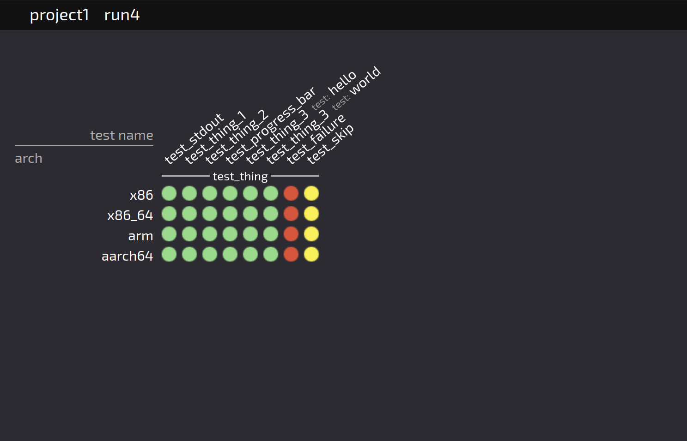

# GreenDots 🟢

A test matrix visualizer, for monitoring live pytest runs and inspecting failures in a graphical way.

It is designed to be very scalable in terms of test count (20k test cases are handled easily) and log file size (megabyte+ sized jsonl log files).

The test status updates are streamed using an append-only status log file per test worker, that is polled by the server when needed.
This eases deployment as it only requires a shared (network) drive between the test runner and the greendots server.

User documentation is limited at the moment, but here's a screenshot:

## Building

The dockerfile should build the server using `npm`, `vite`, and `go`. Internet is required during the docker build.
